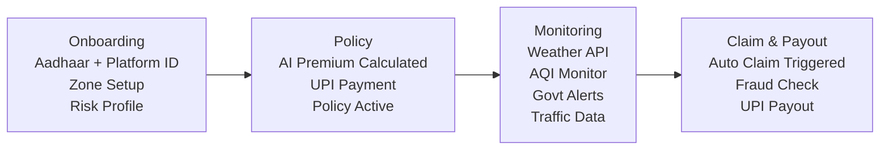

<!-- Header Banner -->
<p align="center">
  
</p>

<p align="center">
  
  
  
  
</p>

<p align="center">
  <code>Protecting Zomato, Swiggy & food delivery partners against income loss from extreme weather, pollution, and social disruptions — with zero-touch claims and instant payouts.</code>
</p>


---

##  The Problem

India's **7.5M+ food delivery partners** lose **20–50% of their income** during external disruptions like heavy rain, extreme heat, floods, pollution spikes, or curfews. They have **zero income protection** against these events.

```
  Normal Month    ████████████████████████████████████  ₹18,000
  Heavy Rain      ████████████████████████░░░░░░░░░░░  ₹12,600  (-30%)
  Extreme Heat    █████████████████████████████░░░░░░  ₹14,400  (-20%)
  Flood/Curfew    ██████████████████░░░░░░░░░░░░░░░░░  ₹9,000   (-50%)
```

---

##  Our Solution

**GigShield AI** automatically detects income-threatening disruptions, triggers claims without manual intervention, and delivers instant payouts — on a **weekly pricing model**.

| Feature | Traditional Insurance | GigShield AI |
|---------|----------------------|--------------|
| Claim Process | Manual, 15–30 days | **Zero-touch, automated** |
| Payout Speed | Weeks to months | **Instant (< 1 hour)** |
| Pricing | Monthly/Annual | **Weekly micro-premiums** |
| Trigger | Subjective assessment | **Parametric data-driven** |
| Fraud Detection | Manual review | **AI-powered real-time** |

```
  DISRUPTION ──▶ AI VALIDATES ──▶ AUTO CLAIM ──▶ FRAUD CHECK ──▶ INSTANT PAYOUT
  (Weather/AQI)   (Parametric)    (Zero-touch)   (AI-powered)    (UPI Transfer)
```

---

##  Chosen Persona: Food Delivery Partners (Zomato / Swiggy)

| Factor | Justification |
|--------|---------------|
| **Weather Sensitivity** | Most weather-dependent gig segment; rain/heat directly halt deliveries |
| **Real-Time Demand** | Zero tolerance for delay — disruptions cause immediate order cancellations |
| **Scale** | 5M+ active delivery partners on Zomato + Swiggy alone |
| **Earnings Pattern** | Weekly payouts standard — aligns with our weekly premium model |
| **Data Availability** | Rich real-time weather, AQI, and traffic data available via APIs |

### Target User Persona

```
  RAVI — Food Delivery Partner, Bangalore
  ─────────────────────────────────────────
  Age: 26  |  Platform: Zomato & Swiggy  |  Hours: 10 AM - 10 PM
  Weekly Earnings: ₹4,000 - ₹5,000  |  Insurance: None
  Pain Point: "When it rains for 2-3 days, I lose half my weekly income."
```

---

## Persona-Based Scenarios

###  Scenario 1: Heavy Rainfall (Mumbai)

> 3 consecutive days of heavy rain (>65mm/day) → Ravi can't deliver → Auto-claim: 3 × ₹650 = **₹1,950 paid to UPI within 1 hour**

###  Scenario 2: Extreme Heat Wave (Delhi)

> 45°C+ for 4 days → Platform reduces slots 12–4 PM → 4hrs/day lost × 4 days → **₹1,040 auto-payout**

###  Scenario 3: Unplanned Curfew (Hyderabad)

> Curfew declared → NLP confirms via news + govt advisory → 2 days × ₹650 → **₹1,300 auto-payout**

###  Scenario 4: AQI Spike (Delhi)

> AQI > 450, GRAP Stage IV → 40% work reduction → **Proportional payout for lost hours**

---

## Application Workflow



---

##  Weekly Premium Model

### Formula
```
Weekly Premium = Base Rate × Zone Risk × Season Multiplier × Claims History ± AI Adjustment
```

The premium is calculated dynamically each week by multiplying a **base rate** (set by the chosen plan tier) with four risk-adjustment factors. Each factor is independently computed using AI/ML models and real-world data, ensuring personalized and fair pricing.

### How Each Factor is Calculated

#### 1. Zone Risk Factor

The Zone Risk quantifies **how disruption-prone a worker's operating area is**, derived from historical data analysis:

| Input Data | Source | What It Measures |
|------------|--------|------------------|
| 5-year rainfall history | IMD Archives | Annual flood/heavy-rain frequency per pin code |
| Historical AQI records | CPCB Database | Pollution severity & duration trends |
| Past curfew/bandh events | News archives, Govt records | Social disruption frequency per city |
| Delivery platform downtime logs | Simulated/Mock data | Platform-reported disruption hours |

**Calculation:** An **XGBoost model** is trained on these features at the pin-code level. It outputs a risk score (0–100), which is then mapped to a multiplier:

```
  Risk Score 0–30   →  ×0.8  (Low Risk:   Pune, Indore, Jaipur)
  Risk Score 31–60  →  ×1.0  (Med Risk:   Bangalore, Hyderabad)
  Risk Score 61–100 →  ×1.3  (High Risk:  Mumbai, Chennai, Kolkata)
```

> **Example:** Mumbai's Zone 4 (Andheri) has 42 heavy-rain days/year + 15 flood alerts/year → Risk Score: 82 → **×1.3**

#### 2. Season Multiplier

The Season Multiplier captures **cyclical weather risk patterns** across the year using time-series forecasting:

| Season | Risk Driver | Data Source | Multiplier |
|--------|-------------|-------------|------------|
| **Monsoon** (Jun–Sep) | Heavy rain, floods, waterlogging | IMD seasonal forecast, 5-year rainfall patterns | **×1.4** |
| **Summer** (Mar–May) | Heat waves (>45°C), heat advisories | IMD temperature records, historical max temps | **×1.1** |
| **Winter** (Oct–Feb) | Fog (limited), cold waves (rare impact) | Historical disruption logs | **×0.9** |

**Calculation:** A **Prophet time-series model** is trained on 5 years of city-level weather + disruption data. It forecasts the expected disruption probability for the upcoming week, which is mapped to the season multiplier. This goes beyond fixed seasons — for example, an unseasonal cyclone in February would dynamically push the multiplier up.

#### 3. Claims History Factor

Rewards responsible usage and penalizes frequent claimants to ensure fund sustainability:

```
  0 claims in last 6 months   →  ×0.85  (15% No-Claim Bonus)
  1–2 claims in last 6 months →  ×1.0   (Standard rate)
  3+ claims in last 6 months  →  ×1.2   (Higher risk profile)
```

#### 4. AI Predictive Adjustment (±15%)

An **LSTM neural network** analyzes the 7-day weather forecast, upcoming event calendars, and recent AQI trends to predict next week's disruption likelihood. It fine-tunes the premium by up to ±15%:

- Heavy rain predicted next week → premium increases by 10–15%
- Clear skies and no events forecasted → premium decreases by 10–15%

### Premium Tiers

Workers choose a coverage tier based on their budget and risk tolerance:

| Plan | Premium | Coverage | Max Payout/Week |
|------|---------|----------|-----------------|
|  **Basic** | ₹29/wk | Weather only | ₹1,500 |
|  **Smart** | ₹49/wk | Weather + Pollution + Curfew | ₹2,500 |
| **Total** | ₹79/wk | All disruptions + Priority | ₹4,000 |

### Summary: Dynamic Pricing Factors

| Factor | Low | Medium | High |
|--------|-----|--------|------|
| **Zone Risk** | ×0.8 (Pune, Indore) | ×1.0 (Bangalore) | ×1.3 (Mumbai, Chennai) |
| **Season** | ×0.9 (Winter) | ×1.1 (Summer) | ×1.4 (Monsoon) |
| **Claims History** | ×0.85 (0 claims) | ×1.0 (1-2 claims) | ×1.2 (3+ claims) |
| **AI Forecast** | -15% (safe week) | 0% | +15% (storm predicted) |

### Worked Example: Ravi (Mumbai, Monsoon, Smart Shield, 0 claims)
```
  Step 1: Base Premium (Smart Shield)       = ₹49.00
  Step 2: × Zone Risk (Mumbai, score 82)    = ×1.3  → ₹63.70
  Step 3: × Season (Monsoon, Jul week 2)    = ×1.4  → ₹89.18
  Step 4: × Claims History (0 in 6 months)  = ×0.85 → ₹75.80
  Step 5: ± AI Adjustment (rain predicted)  = +10%  → ₹83.38
  ────────────────────────────────────────────────────────────
  Final Weekly Premium                      = ₹83 (rounded)
```

---

##  Parametric Triggers

| # | Trigger | Source | Threshold | Payout |
|---|---------|--------|-----------|--------|
| 1 |  Heavy Rain | OpenWeatherMap, IMD | >64.5mm/day, 4+ hrs | ₹500–650/day |
| 2 |  Extreme Heat | OpenWeatherMap, IMD | >45°C | ₹250–400/day |
| 3 |  Flooding | IMD, NDMA | Official flood warning | ₹650/day |
| 4 |  Pollution | CPCB AQI API | AQI >400, 6+ hrs | ₹250–300/day |
| 5 |  Curfew/Bandh | Govt API + NLP | Official shutdown | ₹650/day |

> **Validation:** Every trigger requires confirmation from **2+ independent data sources** before claim activation.

---

##  AI/ML Integration

| Component | Model | Purpose |
|-----------|-------|---------|
| **Zone Risk Scorer** | XGBoost | Risk score per zone from historical weather + disruption frequency |
| **Seasonal Adjuster** | Prophet | Time-series forecasting for seasonal premium multipliers |
| **Predictive Pricing** | LSTM | 7-day weather forecasts → next-week premium adjustment (±15%) |
| **Fraud Detection** | Isolation Forest | Anomaly detection in claims — flags unusual patterns |
| **News Analysis** | NLP (BERT) | Auto-confirm curfew/bandh events from news feeds |

---

## Fraud Detection

**4-Layer Pipeline:**

```
  Claim → [Parametric Validation] → [Location Verification] → [AI Anomaly Check] → [Duplicate Check] → Payout
              ↓ fail                    ↓ fail                   ↓ suspicious          ↓ duplicate
            REJECTED                  FLAGGED                   MANUAL REVIEW          REJECTED
```

| Fraud Type | Detection Method |
|------------|------------------|
| GPS Spoofing | GPS trajectory + cell tower triangulation |
| Fake Weather Claims | Multi-source API cross-validation |
| Duplicate Claims | Hash-based deduplication engine |
| Collusion | Graph network analysis for coordinated behavior |
| Zone Manipulation | Zone-change cooldown + pattern detection |


---

## Adversarial Defense & Anti-Spoofing Strategy

> **Context:** A sophisticated syndicate of 500+ delivery workers has been identified exploiting a competing parametric insurance platform using advanced GPS-spoofing apps to fake their location in severe weather zones — while resting safely at home. GigShield AI is architected from the ground up to defend against this exact attack vector.

---

### 1. The Differentiation — AI/ML Architecture for Genuine vs. Spoofed Claims

Our system uses a **multi-signal behavioral AI pipeline** that goes far beyond comparing a GPS pin to a weather zone. A spoofed GPS coordinate is a single, static lie — our architecture validates the **full behavioral fingerprint** of a delivery partner, making it computationally infeasible to fake.

```mermaid
flowchart TD
    %% Inputs
    GPS[GPS Ping]
    Logs[Order Logs]
    Steps[Step Count]
    Photo[Photo + CV]
    Sound[Sound Snap]
    IP[IP Geoloc]

    %% Engines
    subgraph AI Pipeline [CLAIM VALIDATION PIPELINE v2]
        direction LR
        LocFusion[LOCATION &\nACTIVITY\nFUSION ENGINE]
        AnomalyDet[BEHAVIORAL\nANOMALY\nDETECTOR]
        GraphNet[CROWD &\nSYNDICATE\nANALYSIS]
    end

    %% Connections to Engines
    GPS --> LocFusion
    Logs --> LocFusion
    Steps --> LocFusion
    Steps --> AnomalyDet
    Photo --> LocFusion
    Sound --> LocFusion
    IP --> LocFusion
    IP --> GraphNet

    %% Outputs from Engines
    LocFusion -- "Location & Activity\nConfidence (0-100%)" --> Verdict
    AnomalyDet -- "Anomaly Score\n(0-100)" --> Verdict
    GraphNet -- "Syndicate Score\n(0-100)" --> Verdict

    %% Verdict Node
    Verdict{ENSEMBLE VERDICT\nGradient-Boosted\nDecision Model}

    %% Final Outcomes
    Verdict -- "80-100%" --> Approve[APPROVE\nAuto-pay]
    Verdict -- "40-79%" --> SoftReview[FLAG FOR SOFT REVIEW\n24hr window]
    Verdict -- "0-39%" --> Reject[REJECT\nSyndicate Match]

    classDef approve fill:#064e3b,stroke:#10b981,stroke-width:2px;
    classDef review fill:#78350f,stroke:#f59e0b,stroke-width:2px;
    classDef reject fill:#7f1d1d,stroke:#ef4444,stroke-width:2px;
    
    class Approve approve;
    class SoftReview review;
    class Reject reject;
```



**Key AI Models in the Anti-Spoof Stack:**

| Model | Architecture | Role |
|-------|-------------|------|
| **Activity Fusion Engine** | Multi-input Neural Network | Fuses GPS trajectory, platform order logs, step count, IP geolocation, and signal strength into a single confidence-weighted location + activity estimate. Spoofed GPS with zero platform orders = immediate red flag. |
| **Behavioral Anomaly Detector** | Autoencoder + Isolation Forest | Learns each worker's "normal" motion signature (step cadence, accelerometer jitter, route entropy). A stationary phone with 12 steps claiming to be delivering in a storm scores 95+ anomaly. |
| **Environment Verifier** | CNN (MobileNet-v3) + Audio Classifier | Analyzes submitted photo for rain/flood/wet-road markers and 5-sec ambient audio clip for outdoor storm sounds vs. indoor silence. Two independent environment checks that are extremely hard to fake simultaneously. |
| **Crowd & Syndicate Analyzer** | Graph Neural Network (GNN) | Cross-references claim density per zone, shared IP subnets, synchronized timestamps, and device fingerprints. Detects both coordinated rings and isolated anomalies. |
| **Ensemble Verdict Model** | XGBoost (meta-classifier) | Consumes scores from all layers + historical claim data to output final APPROVE / FLAG / REJECT decision with explainability. |

**How it differentiates a genuinely stranded Ravi from a spoofer:**

```
  GENUINE (Ravi stuck in Mumbai rain)          SPOOFED (Syndicate member at home)
  ─────────────────────────────────────        ──────────────────────────────────────
  [PASS] GPS matches Andheri zone              [PASS] GPS shows Andheri zone (FAKED)
  [PASS] Swiggy logs: 6 deliveries today,      [FAIL] Swiggy logs: last delivery 2 days
         last order accepted 20 min ago                ago, app idle all day
  [PASS] Step counter: 4,200 steps today       [FAIL] Step counter: 83 steps (at home)
  [PASS] Photo: wet road, dark sky, rain       [FAIL] Photo: refused / EXIF mismatch
         visible (CV confidence 94%)               
  [PASS] Ambient audio: rain + traffic         [FAIL] Ambient audio: TV sounds, fan hum
         (outdoor storm classifier: 91%)               (indoor classifier: 96%)
  [PASS] Signal strength: -105 dBm (weak,      [FAIL] Signal strength: -72 dBm (strong,
         consistent with heavy rain)                    consistent with home)
  [PASS] Last 3 hrs: 12 GPS pings across       [FAIL] Last 3 hrs: GPS jumped from home
         delivery routes                               to "storm zone" in 1 ping
  ─────────────────────────────────────        ──────────────────────────────────────
  Location Confidence: 97%                     Location Confidence: 9%
  Anomaly Score: 6 (normal)                    Anomaly Score: 96 (extreme)
  Verdict: AUTO-APPROVE                        Verdict: REJECT + FLAG ACCOUNT
```

---

### 2. The Data — Signals Beyond Basic GPS

GigShield AI ingests **14 independent data signals** organized across four verification dimensions. Every signal chosen works on **budget Android phones (₹8K–12K)** commonly used by Indian delivery partners — no specialized sensors required.

#### Dimension A: Location & Platform Activity (Is the worker actually there and working?)

| # | Data Point | Source | What It Reveals | Spoof Resistance |
|---|-----------|--------|-----------------|------------------|
| 1 | GPS Coordinates | Device GPS | Claimed location | Low — easily spoofed |
| 2 | GPS Ping Trajectory | GigShield SDK (5-min intervals) | Continuous path vs. teleportation jumps | High — requires sustained spoofing |
| 3 | IP Geolocation | MaxMind / ipinfo.io | ISP-level location + VPN detection | Medium — detects home ISPs vs. mobile data |
| 4 | Delivery Platform Order Logs | Zomato / Swiggy Partner API | Was the worker actively online, accepting orders before disruption? | **Very High — completely unfakeable by the worker** |
| 5 | Network Signal Strength | Android TelephonyManager | Heavy rain degrades signal; home = strong stable signal | High — passive, works on all phones |

> **Why this matters:** Signal #4 is the single strongest anti-spoof signal. A spoofer can fake their GPS to Andheri, but they **cannot inject fake delivery orders** into Zomato's backend. If platform logs show zero orders accepted today, the claim is immediately suspicious.

#### Dimension B: Behavioral Biometrics (Was the worker physically active?)

| # | Data Point | Source | What It Reveals | Spoof Resistance |
|---|-----------|--------|-----------------|------------------|
| 6 | Step Counter (Pedometer) | Android Step Sensor API | Genuine delivery = 3,000–8,000 steps/day; at-home spoofer = <500 | **Very High — works on all Android phones, hard to fake** |
| 7 | Accelerometer Pattern | Device IMU sensor | Walking/riding vibration vs. stationary on a table | Very High — continuous motion signature |
| 8 | Battery Drain Rate | Device Battery API | Active delivery (high drain) vs. idle phone at home | Medium — passive signal, corroborative |
| 9 | App Usage Fingerprint | Platform SDK (Swiggy/Zomato) | Time spent on delivery app vs. YouTube/social media | High — validates work activity |

#### Dimension C: Environmental Cross-Validation (Does the real environment match the claim?)

| # | Data Point | Source | What It Reveals | Spoof Resistance |
|---|-----------|--------|-----------------|------------------|
| 10 | **Photo Challenge with CV** | Worker-submitted photo at claim time | CNN (MobileNet-v3) checks for wet roads, dark skies, flooding, closed shops. EXIF timestamp validates freshness. | **Very High — a spoofer cannot produce a rain photo from their living room** |
| 11 | **Ambient Sound Snapshot** | 5-sec mic recording (consent-based) | Audio classifier detects outdoor rain/wind/traffic vs. indoor silence/TV/fan | **Very High — extremely hard to fake outdoor storm sounds** |
| 12 | Hyper-Local Weather Data | OpenWeatherMap + IMD + Amb. Weather | Confirms actual weather conditions at GPS coordinates from multiple APIs | High — ground-truth validation |
| 13 | Street-Level Disruption Reports | Crowd-sourced (Twitter/X, news, NDMA) | NLP-validated flood/disruption reports for the claimed area | High |

> **The Photo + Sound combo** is our most novel anti-spoof innovation. Even if a spoofer fakes their GPS, they'd need to simultaneously produce a convincing rain photo AND a 5-second outdoor storm audio clip — while sitting at home. This is practically impossible without being physically present in the weather event.

#### Dimension D: Crowd Density & Syndicate Detection (Is this part of a coordinated attack?)

| # | Data Point | Source | What It Reveals | Spoof Resistance |
|---|-----------|--------|-----------------|------------------|
| 14 | **Crowd Density Validation** | Internal Claims DB + Weather API | If weather is bad in Zone X, MANY workers should be affected. If only 5 isolated claims arrive from a zone where 200 other insured workers report normal activity — suspicious. | **Very High — unfakeable at scale** |
| 15 | Claim Timing Correlation | Internal Claims DB | Synchronized claims from same IP subnet / device cluster = coordinated fraud | Very High |
| 16 | Shared Device / Network Fingerprint | Device ID + IP subnet | Multiple accounts filing from same device or home network | Very High |

**Syndicate Detection Heuristics (Graph Neural Network):**

```
  IF  (≥ 5 claims from same IP subnet within 30 min)
  AND (crowd density check FAILS — zone-wide claim rate < 10% of insured workers)
  AND (claim timestamps cluster within σ < 120 seconds)
  THEN → FLAG as "Coordinated Ring" → All linked accounts frozen for review
```

> **Key Insight:** A single spoofer can fake GPS. But faking platform order logs + step count + a rain photo + outdoor audio + realistic signal degradation — all simultaneously and consistently — is practically impossible. Our system requires **≥ 4 of 6 verification dimensions to agree** before auto-approving any claim.

---

### 3. The UX Balance — Fair Handling of Flagged Claims

We recognize that honest gig workers in bad weather may have legitimate reasons for unusual signals (e.g., a dead phone swapped to a borrowed one, sheltering under a flyover with weak cell signal). **GigShield AI is designed to protect workers first, catch fraudsters second.**

#### Tiered Verdict System

```mermaid
flowchart TD
    A([Claim Received]) --> B{CONFIDENCE SCORE\n0 - 100%}
    
    B -- 80-100% --> C[AUTO APPROVE\nInstant payout]
    B -- 40-79% --> D[SOFT REVIEW\n24hr grace period]
    B -- 0-39% --> E[HARD REJECT\nSyndicate pattern match]

    classDef approve fill:#064e3b,stroke:#10b981,stroke-width:2px;
    classDef review fill:#78350f,stroke:#f59e0b,stroke-width:2px;
    classDef reject fill:#7f1d1d,stroke:#ef4444,stroke-width:2px;
    
    class C approve;
    class D review;
    class E reject;
```



#### How Each Tier Works

| Tier | Trigger | Worker Experience | Internal Action |
|------|---------|-------------------|-----------------|
| **Auto-Approve** (80–100% confidence) | All signals align — worker is clearly in the disruption zone | Instant UPI payout within 1 hour. No friction. | Standard logging, no review needed. |
| **Soft Review** (40–79% confidence) | Some signals mismatch but no syndicate indicators — could be genuine edge case | **Worker gets a push notification:** *"Your claim is being reviewed. You can add context (photo of location, screenshot of platform app) to speed things up. Payout within 24 hours."* | Claim enters a lightweight async review. Worker can submit optional evidence. If no syndicate link found in 24 hrs → **auto-approved.** Most honest workers clear this automatically. |
| **Hard Reject** (0–39% confidence) | Strong syndicate pattern OR overwhelming signal mismatch | Worker notified: *"Claim could not be verified. If you believe this is an error, you can appeal."* | Account flagged. If part of a detected ring → account suspended pending investigation. Appeal process available. |

#### Protecting Honest Workers — Specific Safeguards

| Scenario | Why Signals Might Mismatch | How GigShield Handles It |
|----------|---------------------------|--------------------------|
| Phone died, borrowed friend's phone | Device ID changes, no historical trajectory | Soft Review — photo + audio evidence still works. Platform delivery logs (Swiggy/Zomato) validate the worker was active. |
| Sheltering under flyover | GPS may drift, unusual location for the worker | Soft Review — ambient audio still captures outdoor rain sounds. Weather API confirms storm. Photo challenge shows outdoor environment. Auto-approved if environmental data matches. |
| Network drop in heavy rain | GPS gaps, intermittent pings | System uses **last known good trajectory** + step counter data. Gaps ≤ 30 min in verified storm zones are auto-tolerated. |
| Battery saver mode on | Reduced sensor data (lower accelerometer sampling) | System adjusts confidence thresholds for known low-power mode. Step counter still works in background. Does not penalize reduced data volume. |
| New user, no history | Behavioral model has no baseline | First 4 weeks: generous thresholds (Soft Review at 30% instead of 40%). Claims history is bootstrapped from platform delivery records. |
| User declines mic/camera permission | Cannot collect photo or audio evidence | System relies on remaining signals (GPS trajectory, step count, platform logs, IP, signal strength). Slightly lower confidence but not penalized — just can't fast-track to auto-approve. |

#### Worker-Facing Transparency

- **Claim status tracker** in the app: Workers see real-time status (Verifying → Reviewing → Approved/Paid).
- **No black-box rejections**: Every rejection includes a human-readable reason: *"Location signals did not match the claimed disruption zone."*
- **One-tap appeal**: Workers can appeal any rejection with optional supporting evidence (photo, delivery app screenshot).
- **Monthly trust score**: Workers can see their trust score (anonymized). Consistent genuine behavior → faster future payouts and lower premiums via the No-Claim Bonus.

#### Syndicate-Specific Deterrents

```mermaid
flowchart TD
    subgraph Protocol [SYNDICATE RESPONSE PROTOCOL]
        direction TB
        Step1[1. Ring Detected\nGNN flags ≥5 correlated accounts]
        Action1[All linked accounts: claims frozen, payouts held]
        
        Step2[2. Investigation\nAutomated + manual, 48hr SLA]
        Action2A[Cross-reference Telegram group intelligence via NLP scrape]
        Action2B[Verify device IDs, IPs, photo EXIF data across accounts]
        
        Step3{3. Outcome}
        OutcomeFraud[CONFIRMED FRAUD\nAccount banned, recovery initiated,\nplatform partner notified]
        OutcomeFalsePos[FALSE POSITIVE\nAccounts restored, compensatory payout,\napology + fast-track future claims]
        
        Step1 --> Action1
        Action1 --> Step2
        Step2 --> Action2A
        Step2 --> Action2B
        Action2A --> Step3
        Action2B --> Step3
        Step3 -->|Match| OutcomeFraud
        Step3 -->|No Match| OutcomeFalsePos
    end
    
    classDef alert fill:#7f1d1d,stroke:#ef4444,stroke-width:2px;
    classDef success fill:#064e3b,stroke:#10b981,stroke-width:2px;
    
    class OutcomeFraud alert;
    class OutcomeFalsePos success;
```



> **Philosophy:** We would rather pay 10 borderline-genuine claims than wrongly deny 1 honest worker's lifeline. The system is tuned for **high recall on genuine claims** while maintaining a **hard wall against coordinated syndicate behavior** via graph analysis.

---

##  Tech Stack


| Layer | Technology |
|-------|-----------|
| **Frontend** | React.js + TypeScript, Tailwind CSS + Shadcn/UI, Recharts, PWA |
| **Backend** | Node.js + Express (API), Python FastAPI (ML Services), WebSocket |
| **AI/ML** | XGBoost, Prophet, LSTM, Isolation Forest, BERT NLP |
| **Database** | PostgreSQL (primary), Redis (cache), MongoDB (event logs) |
| **Auth** | JWT + OAuth 2.0 |
| **Payments** | Razorpay Sandbox (UPI) |
| **External APIs** | OpenWeatherMap, CPCB AQI, IMD Alerts, Aadhaar Mock KYC |
| **Hosting** | Vercel (Frontend) + Railway (Backend) |

**Platform:** Progressive Web App (PWA) — installable, push notifications, works on any device.

---

##  Development Roadmap

| Phase | Timeline | Deliverables | Status |
|-------|----------|-------------|--------|
| **Phase 1 — Ideation** | Mar 4–20 | README, Idea Doc, Prototype, 2-min Video | 🔄 In Progress |
| **Phase 2 — Build** | Mar 21–Apr 4 | Registration, Policy Mgmt, Premium AI, Claims Automation | ⏳ Upcoming |
| **Phase 3 — Scale** | Apr 5–17 | Fraud Detection, Payouts, Dashboards, Final Video + Pitch | ⏳ Upcoming |

---

##  Innovation Highlights

| Feature | Description |
|---------|-------------|
| 🌤️ **Predictive Pre-Coverage** | AI predicts disruptions 3–7 days ahead, auto-activates enhanced coverage |
| 🤝 **Platform Partnerships** | Zomato/Swiggy API integration for direct premium deduction |
| 📍 **Hyper-Local Mapping** | Pin-code level risk assessment |
| 🏆 **No-Claim Bonus** | Up to 15% progressive premium discount |
| 💬 **WhatsApp Bot** | Claim status & payout notifications via WhatsApp |

---

<p align="center">
  <b>GigShield AI</b> — Because every delivery matters, and every delivery partner deserves protection.
</p>

<p align="center">
  
  
</p>

<p align="center">
  
</p>
