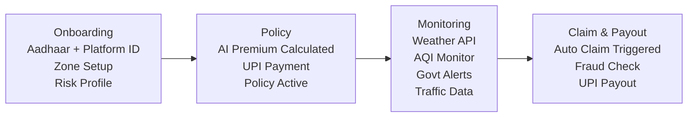

<!-- Header Banner -->
<p align="center">
  
</p>

<p align="center">
  
  
  
  
</p>

<p align="center">
  <code>Protecting Zomato, Swiggy & food delivery partners against income loss from extreme weather, pollution, and social disruptions — with zero-touch claims and instant payouts.</code>
</p>


---

##  The Problem

India's **7.5M+ food delivery partners** lose **20–50% of their income** during external disruptions like heavy rain, extreme heat, floods, pollution spikes, or curfews. They have **zero income protection** against these events.

```
  Normal Month    ████████████████████████████████████  ₹18,000
  Heavy Rain      ████████████████████████░░░░░░░░░░░  ₹12,600  (-30%)
  Extreme Heat    █████████████████████████████░░░░░░  ₹14,400  (-20%)
  Flood/Curfew    ██████████████████░░░░░░░░░░░░░░░░░  ₹9,000   (-50%)
```

---

##  Our Solution

**GigShield AI** automatically detects income-threatening disruptions, triggers claims without manual intervention, and delivers instant payouts — on a **weekly pricing model**.

| Feature | Traditional Insurance | GigShield AI |
|---------|----------------------|--------------|
| Claim Process | Manual, 15–30 days | **Zero-touch, automated** |
| Payout Speed | Weeks to months | **Instant (< 1 hour)** |
| Pricing | Monthly/Annual | **Weekly micro-premiums** |
| Trigger | Subjective assessment | **Parametric data-driven** |
| Fraud Detection | Manual review | **AI-powered real-time** |

```
  DISRUPTION ──▶ AI VALIDATES ──▶ AUTO CLAIM ──▶ FRAUD CHECK ──▶ INSTANT PAYOUT
  (Weather/AQI)   (Parametric)    (Zero-touch)   (AI-powered)    (UPI Transfer)
```

---

##  Chosen Persona: Food Delivery Partners (Zomato / Swiggy)

| Factor | Justification |
|--------|---------------|
| **Weather Sensitivity** | Most weather-dependent gig segment; rain/heat directly halt deliveries |
| **Real-Time Demand** | Zero tolerance for delay — disruptions cause immediate order cancellations |
| **Scale** | 5M+ active delivery partners on Zomato + Swiggy alone |
| **Earnings Pattern** | Weekly payouts standard — aligns with our weekly premium model |
| **Data Availability** | Rich real-time weather, AQI, and traffic data available via APIs |

### Target User Persona

```
  RAVI — Food Delivery Partner, Bangalore
  ─────────────────────────────────────────
  Age: 26  |  Platform: Zomato & Swiggy  |  Hours: 10 AM - 10 PM
  Weekly Earnings: ₹4,000 - ₹5,000  |  Insurance: None
  Pain Point: "When it rains for 2-3 days, I lose half my weekly income."
```

---

## Persona-Based Scenarios

###  Scenario 1: Heavy Rainfall (Mumbai)

> 3 consecutive days of heavy rain (>65mm/day) → Ravi can't deliver → Auto-claim: 3 × ₹650 = **₹1,950 paid to UPI within 1 hour**

###  Scenario 2: Extreme Heat Wave (Delhi)

> 45°C+ for 4 days → Platform reduces slots 12–4 PM → 4hrs/day lost × 4 days → **₹1,040 auto-payout**

###  Scenario 3: Unplanned Curfew (Hyderabad)

> Curfew declared → NLP confirms via news + govt advisory → 2 days × ₹650 → **₹1,300 auto-payout**

###  Scenario 4: AQI Spike (Delhi)

> AQI > 450, GRAP Stage IV → 40% work reduction → **Proportional payout for lost hours**

---

## Application Workflow



---

##  Weekly Premium Model

### Formula
```
Weekly Premium = Base Rate × Zone Risk × Season Multiplier × Claims History ± AI Adjustment
```

The premium is calculated dynamically each week by multiplying a **base rate** (set by the chosen plan tier) with four risk-adjustment factors. Each factor is independently computed using AI/ML models and real-world data, ensuring personalized and fair pricing.

### How Each Factor is Calculated

#### 1. Zone Risk Factor

The Zone Risk quantifies **how disruption-prone a worker's operating area is**, derived from historical data analysis:

| Input Data | Source | What It Measures |
|------------|--------|------------------|
| 5-year rainfall history | IMD Archives | Annual flood/heavy-rain frequency per pin code |
| Historical AQI records | CPCB Database | Pollution severity & duration trends |
| Past curfew/bandh events | News archives, Govt records | Social disruption frequency per city |
| Delivery platform downtime logs | Simulated/Mock data | Platform-reported disruption hours |

**Calculation:** An **XGBoost model** is trained on these features at the pin-code level. It outputs a risk score (0–100), which is then mapped to a multiplier:

```
  Risk Score 0–30   →  ×0.8  (Low Risk:   Pune, Indore, Jaipur)
  Risk Score 31–60  →  ×1.0  (Med Risk:   Bangalore, Hyderabad)
  Risk Score 61–100 →  ×1.3  (High Risk:  Mumbai, Chennai, Kolkata)
```

> **Example:** Mumbai's Zone 4 (Andheri) has 42 heavy-rain days/year + 15 flood alerts/year → Risk Score: 82 → **×1.3**

#### 2. Season Multiplier

The Season Multiplier captures **cyclical weather risk patterns** across the year using time-series forecasting:

| Season | Risk Driver | Data Source | Multiplier |
|--------|-------------|-------------|------------|
| **Monsoon** (Jun–Sep) | Heavy rain, floods, waterlogging | IMD seasonal forecast, 5-year rainfall patterns | **×1.4** |
| **Summer** (Mar–May) | Heat waves (>45°C), heat advisories | IMD temperature records, historical max temps | **×1.1** |
| **Winter** (Oct–Feb) | Fog (limited), cold waves (rare impact) | Historical disruption logs | **×0.9** |

**Calculation:** A **Prophet time-series model** is trained on 5 years of city-level weather + disruption data. It forecasts the expected disruption probability for the upcoming week, which is mapped to the season multiplier. This goes beyond fixed seasons — for example, an unseasonal cyclone in February would dynamically push the multiplier up.

#### 3. Claims History Factor

Rewards responsible usage and penalizes frequent claimants to ensure fund sustainability:

```
  0 claims in last 6 months   →  ×0.85  (15% No-Claim Bonus)
  1–2 claims in last 6 months →  ×1.0   (Standard rate)
  3+ claims in last 6 months  →  ×1.2   (Higher risk profile)
```

#### 4. AI Predictive Adjustment (±15%)

An **LSTM neural network** analyzes the 7-day weather forecast, upcoming event calendars, and recent AQI trends to predict next week's disruption likelihood. It fine-tunes the premium by up to ±15%:

- Heavy rain predicted next week → premium increases by 10–15%
- Clear skies and no events forecasted → premium decreases by 10–15%

### Premium Tiers

Workers choose a coverage tier based on their budget and risk tolerance:

| Plan | Premium | Coverage | Max Payout/Week |
|------|---------|----------|-----------------|
|  **Basic** | ₹29/wk | Weather only | ₹1,500 |
|  **Smart** | ₹49/wk | Weather + Pollution + Curfew | ₹2,500 |
| **Total** | ₹79/wk | All disruptions + Priority | ₹4,000 |

### Summary: Dynamic Pricing Factors

| Factor | Low | Medium | High |
|--------|-----|--------|------|
| **Zone Risk** | ×0.8 (Pune, Indore) | ×1.0 (Bangalore) | ×1.3 (Mumbai, Chennai) |
| **Season** | ×0.9 (Winter) | ×1.1 (Summer) | ×1.4 (Monsoon) |
| **Claims History** | ×0.85 (0 claims) | ×1.0 (1-2 claims) | ×1.2 (3+ claims) |
| **AI Forecast** | -15% (safe week) | 0% | +15% (storm predicted) |

### Worked Example: Ravi (Mumbai, Monsoon, Smart Shield, 0 claims)
```
  Step 1: Base Premium (Smart Shield)       = ₹49.00
  Step 2: × Zone Risk (Mumbai, score 82)    = ×1.3  → ₹63.70
  Step 3: × Season (Monsoon, Jul week 2)    = ×1.4  → ₹89.18
  Step 4: × Claims History (0 in 6 months)  = ×0.85 → ₹75.80
  Step 5: ± AI Adjustment (rain predicted)  = +10%  → ₹83.38
  ────────────────────────────────────────────────────────────
  Final Weekly Premium                      = ₹83 (rounded)
```

---

##  Parametric Triggers

| # | Trigger | Source | Threshold | Payout |
|---|---------|--------|-----------|--------|
| 1 |  Heavy Rain | OpenWeatherMap, IMD | >64.5mm/day, 4+ hrs | ₹500–650/day |
| 2 |  Extreme Heat | OpenWeatherMap, IMD | >45°C | ₹250–400/day |
| 3 |  Flooding | IMD, NDMA | Official flood warning | ₹650/day |
| 4 |  Pollution | CPCB AQI API | AQI >400, 6+ hrs | ₹250–300/day |
| 5 |  Curfew/Bandh | Govt API + NLP | Official shutdown | ₹650/day |

> **Validation:** Every trigger requires confirmation from **2+ independent data sources** before claim activation.

---

##  AI/ML Integration

| Component | Model | Purpose |
|-----------|-------|---------|
| **Zone Risk Scorer** | XGBoost | Risk score per zone from historical weather + disruption frequency |
| **Seasonal Adjuster** | Prophet | Time-series forecasting for seasonal premium multipliers |
| **Predictive Pricing** | LSTM | 7-day weather forecasts → next-week premium adjustment (±15%) |
| **Fraud Detection** | Isolation Forest | Anomaly detection in claims — flags unusual patterns |
| **News Analysis** | NLP (BERT) | Auto-confirm curfew/bandh events from news feeds |

---

## Fraud Detection

**4-Layer Pipeline:**

```
  Claim → [Parametric Validation] → [Location Verification] → [AI Anomaly Check] → [Duplicate Check] → Payout
              ↓ fail                    ↓ fail                   ↓ suspicious          ↓ duplicate
            REJECTED                  FLAGGED                   MANUAL REVIEW          REJECTED
```

| Fraud Type | Detection Method |
|------------|------------------|
| GPS Spoofing | GPS trajectory + cell tower triangulation |
| Fake Weather Claims | Multi-source API cross-validation |
| Duplicate Claims | Hash-based deduplication engine |
| Collusion | Graph network analysis for coordinated behavior |
| Zone Manipulation | Zone-change cooldown + pattern detection |

---

##  Tech Stack


| Layer | Technology |
|-------|-----------|
| **Frontend** | React.js + TypeScript, Tailwind CSS + Shadcn/UI, Recharts, PWA |
| **Backend** | Node.js + Express (API), Python FastAPI (ML Services), WebSocket |
| **AI/ML** | XGBoost, Prophet, LSTM, Isolation Forest, BERT NLP |
| **Database** | PostgreSQL (primary), Redis (cache), MongoDB (event logs) |
| **Auth** | JWT + OAuth 2.0 |
| **Payments** | Razorpay Sandbox (UPI) |
| **External APIs** | OpenWeatherMap, CPCB AQI, IMD Alerts, Aadhaar Mock KYC |
| **Hosting** | Vercel (Frontend) + Railway (Backend) |

**Platform:** Progressive Web App (PWA) — installable, push notifications, works on any device.

---

##  Development Roadmap

| Phase | Timeline | Deliverables | Status |
|-------|----------|-------------|--------|
| **Phase 1 — Ideation** | Mar 4–20 | README, Idea Doc, Prototype, 2-min Video | 🔄 In Progress |
| **Phase 2 — Build** | Mar 21–Apr 4 | Registration, Policy Mgmt, Premium AI, Claims Automation | ⏳ Upcoming |
| **Phase 3 — Scale** | Apr 5–17 | Fraud Detection, Payouts, Dashboards, Final Video + Pitch | ⏳ Upcoming |

---

##  Innovation Highlights

| Feature | Description |
|---------|-------------|
| 🌤️ **Predictive Pre-Coverage** | AI predicts disruptions 3–7 days ahead, auto-activates enhanced coverage |
| 🤝 **Platform Partnerships** | Zomato/Swiggy API integration for direct premium deduction |
| 📍 **Hyper-Local Mapping** | Pin-code level risk assessment |
| 🏆 **No-Claim Bonus** | Up to 15% progressive premium discount |
| 💬 **WhatsApp Bot** | Claim status & payout notifications via WhatsApp |

---

<p align="center">
  <b>GigShield AI</b> — Because every delivery matters, and every delivery partner deserves protection.
</p>

<p align="center">
  
  
</p>

<p align="center">
  
</p>
